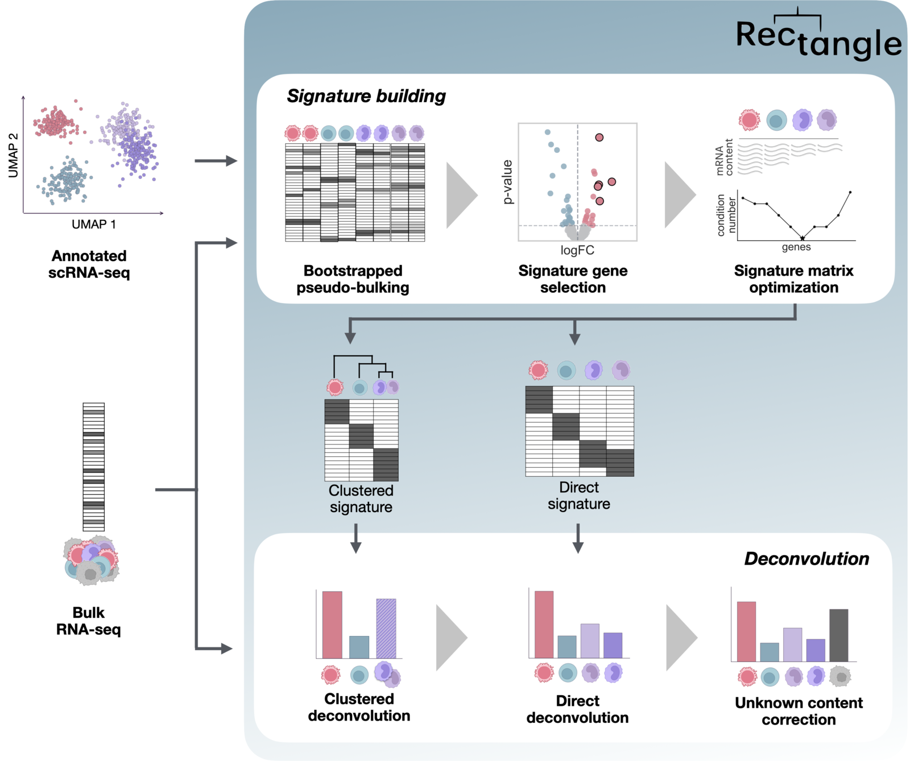

# Rectangle

[![Tests][badge-tests]][link-tests]
[![Documentation][badge-docs]][link-docs]

[badge-tests]: https://img.shields.io/github/actions/workflow/status/ComputationalBiomedicineGroup/Rectangle/build.yaml?branch=main
[link-tests]: https://github.com/ComputationalBiomedicineGroup/Rectangle/actions/workflows/build.yaml
[badge-docs]: https://img.shields.io/readthedocs/rectanglepy

Rectangle is an open-source Python package for single-cell-informed cell-type deconvolution of bulk and spatial transcriptomic data, which is part of the [scverse ecosystem](https://scverse.org/packages/).

Rectangle presents a novel approach to second-generation deconvolution, characterized by hierarchical signature building for fine-grained cell-type deconvolution, estimation and correction of unknown cellular content, and efficient handling of large-scale single-cell data during signature matrix computation.

Rectangle was developed to overcome the current challenges in cell-type deconvolution, providing a robust and accurate methodology while ensuring a low computational profile.

## Getting started

Please refer to the [documentation][link-docs]. In particular, the

-   [Tutorials][link-docs/tutorials] for a step-by-step guide on how to use Rectangle, and the

-   [API documentation][link-api].

## Installation

You need Python 3.10–3.12 installed on your system.

How to install Rectangle:

Install the latest release of `Rectangle` from `PyPI` <https://pypi.org/project/rectanglepy/>:

```bash
pip install rectanglepy
```

## How Rectangle works



Rectangle performs robust multiscale deconvolution informed by single-cell transcriptomics. Rectangle takes annotated scRNA-seq data and a bulk RNA-seq mixture as input. In the signature-building phase, it performs bootstrapped pseudobulking of the scRNA-seq data, followed by signature-gene selection based on log-fold-change (logFC) and p-value, and signature-matrix optimization (minimizing the condition number and correcting for cell-type-specific mRNA content bias). Based on this, it constructs two signature matrices: a “direct signature”, resolving individual cell types, and a “clustered signature” grouping transcriptionally similar cell types. In the deconvolution phase, Rectangle first uses the clustered signature to deconvolve the bulk data into coarse cell-type estimates. These are then used to constrain a second deconvolution step that leverages the direct signature to resolve individual cell-type fractions. Finally, the resulting estimates are scaled to account for unknown cellular content not represented in the reference.

## License

Rectangle is dual-licensed: BSD-3-Clause OR Commercial.

### Open-source option: BSD-3-Clause

You may use, modify, and redistribute Rectangle, including in proprietary products, if you keep the copyright and license notices and do not use the authors’ names for endorsement.

See [LICENSE](LICENSE).

### Commercial option

For alternative terms, such as warranties, indemnities, dedicated support, SLAs, or redistribution without BSD notice requirements, contact innovation-psb@uibk.ac.at.

See [LICENSE-Commercial.md](LICENSE-Commercial.md).

## Release notes

See the [changelog][changelog].

## Contact

If you found a bug, please use the [issue tracker][issue-tracker].

For commercial licensing: **innovation-psb@uibk.ac.at**

## Citation

If you use Rectangle in your project, please cite:

> Eder B, Rigato I, Dietrich A, Merotto L, Sturm G, Treis T, List M, Theis FJ, Finotello F. Rectangle: robust and scalable multiscale deconvolution informed by single-cell RNA sequencing data. bioRxiv. 2026. doi:[10.64898/2026.07.07.736950](https://doi.org/10.64898/2026.07.07.736950)

[scverse-discourse]: https://discourse.scverse.org/
[issue-tracker]: https://github.com/ComputationalBiomedicineGroup/Rectangle/issues
[changelog]: https://rectanglepy.readthedocs.io/changelog.html
[link-docs]: https://Rectanglepy.readthedocs.io
[link-api]: https://rectanglepy.readthedocs.io/api.html
[link-docs/tutorials]: https://rectanglepy.readthedocs.io/notebooks/example.html
